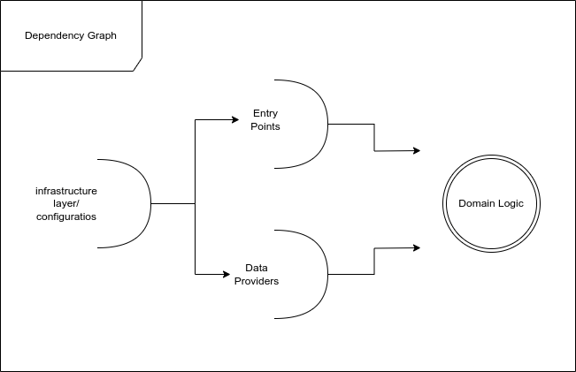

# Fast Meerkat - Overview

This is a slightly modified architecture driven from clean architecture, is focused on the innermost layer as a unit called the domain layer

Contains:
- Entities/Models
- Use Cases
- Interface Adapters


This is how the dependencies are linked, from the outermost (infrastructure) to the innermost (domain)




We follow this directory structure, later in this document, a detailed tutorial about how to implement a notes service as an example, explaining each aspect with granular details...
```
thisapp/services/note

├── domain			# the innermost layer (domain logic)
│   ├── models.py
│   ├── repositories.py
│   ├── exceptions.py
│   └── usecases
│       ├── get_user.py
│       ├── login.py
│       ├── register.py
│       └── user_list.py

├── dataproviders		# concrete data providers
│   └── beanie
│       ├── models.py
│       └── repositories.py

├── entrypoints		 # entrypoints of the service, such as RESTful API endpoints, cli...etc

└── infra		# Contains infrastructure code including authentication, dependency injection, and testing.
    ├── di
    │   └── providers.py
    └── tests
        ├── conftest.py
        └── domain
            ├── test_user_model.py
            └── usecases
                ├── test_get_user_info.py
                ├── test_get_user_list.py
                ├── test_login.py
                └── test_register.py

```

To create the previous structure we can use the following command:
```bash
make new-svc <service-name>
```

In this tutorial we are using thisapp as a root namespace, use anything you see fit.

## Tutorial: Notes Service in Clean Architecture

### Part 1: Domain

First, let's focus on the inner circle which is encompasses the domain, and we will go from inner to outer layers as this tutorial progresses

#### 1. Define the UseCase

Start by defining the use case that represents the business operation you want to perform.

```python
class CreateNoteUseCase(CommandUseCase[CreateNoteCommand]):

    @inject
    def __init__(self, note_repo: AbstractNoteRepo):
        self.note_repo = note_repo

    async def execute(self, command: CreateNoteCommand) -> NoteModel:
        note = NoteModel(title=command.title, content=command.content, created_at=datetime.utcnow(), updated_at=datetime.utcnow())
        return await self.note_repo.create(note)
```

* Within the use case, define the command that represents the action you want to perform.

```python
class CreateNoteCommand(Command):
    title: str
    content: str
```

#### 2. Define the Domain Model

Define the domain model that represents the core business object in your application.

```python
from pydantic import BaseModel
from datetime import datetime

class NoteModel(BaseModel):
    id: int
    title: str
    content: str
    created_at: datetime
    updated_at: datetime
```

#### 3. Define the data provider interface

Here we define the interface that represents the operations you can perform on this repository

```python
from abc import ABC, abstractmethod
from typing import Optional

class AbstractNoteRepo(ABC):

    @abstractmethod
    async def create(self, note: NoteModel) -> NoteModel:
        pass

    @abstractmethod
    async def find_by_id(self, note_id: int) -> Optional[NoteModel]:
        pass

```

#### 4. Test the UseCase

Before implementing the data storage, write tests for the use case. Mock the repository to simulate the behavior of the data storage.

```python
from unittest.mock import Mock, AsyncMock

def test_create_note_use_case():
    mock_repo = Mock(AbstractNoteRepo)
    mock_repo.create = AsyncMock(return_value=NoteModel(id=1, title="Test", content="Test content", created_at=datetime.utcnow(), updated_at=datetime.utcnow()))

    use_case = CreateNoteUseCase(mock_repo)
    command = CreateNoteCommand(title="Test", content="Test content")

    result = asyncio.run(use_case.execute(command))

    assert result.id == 1
    assert result.title == "Test"
```

### Part 2: Implementing a Data Provider (SQLAlchemy) 

Depending on your choice of data storage, implement the repository. Here's an example using SQLAlchemy:

```python
# thisapp.services.note.dataproviders.alchemy.models
class Note(Base):
    __tablename__ = "notes"

    id = Column(Integer, primary_key=True, index=True)
    title = Column(String, index=True)
    content = Column(String)
    created_at = Column(DateTime, default=datetime.utcnow)
    updated_at = Column(DateTime, default=datetime.utcnow, onupdate=datetime.utcnow)

# thisapp.services.note.dataproviders.alchemy.repositories

from thisapp.services.note.domain.repositories import AbstractNoteRepo
from thisapp.services.note.domain.models import NoteModel
from thisapp.services.note.dataproviders.alchemy.models import Note
from atumm.extensions.alchemy import AsyncSessionFactory
from injector import inject
from typing import Optional

def map_note_to_domain_model(orm_note: Note) -> NoteModel:
    return NoteModel(
        id=orm_note.id,
        title=orm_note.title,
        content=orm_note.content,
        # ... 
    )

class NoteRepo(AbstractNoteRepo):

    @inject
    def __init__(self, session_factory: AsyncSessionFactory):
        self.session_factory = session_factory

    async def create(self, note: NoteModel) -> NoteModel:
        async with self.session_factory.new_session() as session:
            new_note = Note(**note.dict())
            session.add(new_note)
            await session.commit()
            await session.refresh(new_note)
            return map_note_to_domain_model(new_note)

    async def find_by_id(self, note_id: int) -> Optional[NoteModel]:
        async with self.session_factory.new_session() as session:
            orm_note = await session.query(Note).filter(Note.id == note_id).one_or_none()
            return map_note_to_domain_model(orm_note) if orm_note else None
```

---

### Part 3: Implementing a RESTful Interface

Let's zoom in on the entrypoints part of the system, as you may know, these entrypoints, expose the applications' features through interfaces, whether rest, cli, workers ...etc.

### Directory Structure:

```
thisapp/services/note/entrypoints/rest
├── notes
│   ├── controllers.py
│   ├── presenters.py
│   ├── requests.py
│   ├── responses.py
│   └── routers.py
```

This structure represents a service with a REST resource for notes.

### Step-by-step Implementation:

1. **Router**: This will define the REST routes and delegate the actual work to the controller.

```python
## routers.py
from classy_fastapi import Routable, post, get
from injector import inject

from thisapp.services.note.entrypoints.rest.notes.controllers import NotesController
from thisapp.services.note.entrypoints.rest.notes.requests import CreateNoteRequest
from thisapp.services.note.entrypoints.rest.notes.responses import NoteResponse

class NotesRouter(Routable):
    @inject
    def __init__(self, controller: NotesController):
        super().__init__(prefix="/notes")
        self.controller = controller

    @post(
        "/",
        responses={
            "200": {"model": NoteResponse},
            "400": {"model": RuntimeExceptionResponse},
        },
    )
    async def create_note(self, request: CreateNoteRequest) -> NoteResponse:
        return await self.controller.create(request)

    @get(
        "/{note_id}",
        responses={
            "200": {"model": NoteResponse},
            "404": {"model": RuntimeExceptionResponse},
        },
    )
    async def get_note(self, note_id: int) -> NoteResponse:
        return await self.controller.get_by_id(note_id)
```

2. **Controller**: Handles business logic and returns a final representation for the router calls.

```python
## controllers.py
from injector import inject

from thisapp.services.note.domain.usecases.create_note import CreateNoteCommand, CreateNoteUseCase
from thisapp.services.note.domain.usecases.get_note import GetNoteCommand, GetNoteUseCase
from thisapp.services.note.entrypoints.rest.notes.presenters import NotePresenter
from thisapp.services.note.entrypoints.rest.notes.requests import CreateNoteRequest
from thisapp.services.note.entrypoints.rest.notes.responses import NoteResponse

class NotesController:
    @inject
    def __init__(
        self,
        presenter: NotePresenter,
        create_note_use_case: CreateNoteUseCase,
        get_note_use_case: GetNoteUseCase,
    ):
        self.presenter = presenter
        self.create_note_use_case = create_note_use_case
        self.get_note_use_case = get_note_use_case

    async def create(self, request: CreateNoteRequest) -> NoteResponse:
        note = await self.create_note_use_case.execute(
            CreateNoteCommand(title=request.title, content=request.content)
        )
        return self.presenter.present(note)

    async def get_by_id(self, note_id: int) -> NoteResponse:
        note = await self.get_note_use_case.execute(GetNoteCommand(id=note_id))
        return self.presenter.present(note)
```

3. **Presenter**: Present Business Objects.

```python
## presenters.py
from atumm.core.presenter import AbstractPresenter
from thisapp.services.note.entrypoints.rest.notes.responses import NoteResponse

class NotePresenter(AbstractPresenter[NoteModel, NoteResponse]):
    def present(self, note: NoteModel) -> NoteResponse:
        return NoteResponse(id=note.id, title=note.title, content=note.content)
```

4. **Requests**: Pydantic objects to be received.

```python
## requests.py
from pydantic import BaseModel, Field

class CreateNoteRequest(BaseModel):
    title: str = Field(..., description="Note Title")
    content: str = Field(..., description="Note Content")
```

5. **Responses**: Pydantic objects for the response models.

```python
## responses.py
from pydantic import BaseModel, Field

class NoteResponse(BaseModel):
    id: int = Field(..., description="Note ID")
    title: str = Field(..., description="Note Title")
    content: str = Field(..., description="Note Content")
```


### Part 4: Configurations

In this part we'll glue everything together, using injector and buti, defining configurations like DB URL...etc

### Dependency Injection for the Note Service:

1. **Providers for the Note Service**:

```python
# thisapp/services/note/infra/di/providers.py
from atumm.core.infra.config import Config
from thisapp.services.note.dataproviders.beanie.repositories import NoteRepo
from thisapp.services.note.domain.repositories import AbstractNoteRepo
from injector import Binder, Module, singleton

class NoteRepoProvider(Module):
    def configure(self, binder: Binder):
        binder.bind(
            interface=AbstractNoteRepo,
            to=NoteRepo(),
            scope=singleton,
        )

note_providers = [NoteRepoProvider]
```

2. **Note Service Configuration**:

```python
# thisapp/services/note/__init__.py
from atumm.core.infra.config import Config, configure
from pydantic.fields import Field

@configure
class NoteConfig(Config):
    # Add any configuration specific to the Note service here.
    pass
```

3. **Note Service Component for Buti**:

Here we register this service in the app, providing any boot procedures we need, in this case we need to register the 
REST router to the FastAPI app

```python
# thisapp/services/note/infra/buti/__init__.py
from atumm.extensions.buti.keys import AtummContainerKeys
from thisapp.services.note.entrypoints.rest.notes.routers import NotesRouter
from buti import BootableComponent, ButiStore
from fastapi import APIRouter, FastAPI
from injector import Injector

class NoteServiceComponent(BootableComponent):
    def boot(self, object_store: ButiStore):
        app: FastAPI = object_store.get(AtummContainerKeys.app)
        injector_obj: Injector = object_store.get(AtummContainerKeys.injector)

        note_router = injector_obj.get(NotesRouter)

        note_api_router = APIRouter()
        note_api_router.include_router(
            note_router.router, prefix="/api/v1", tags=["Notes"]
        )
        app.include_router(note_api_router)
```

4. **Update Main App**:

In `thisapp/main.py`, make sure to import the `NoteConfig` and add the `NoteServiceComponent` to the `app_components` list.

```python
# thisapp/main.py
from thisapp.services.note import NoteConfig
from thisapp.services.note.infra.buti import NoteServiceComponent

# ... [rest of the imports] ...

app_components.extend([NoteServiceComponent()])
```

This setup ensures that the `Note` service is integrated into the main app